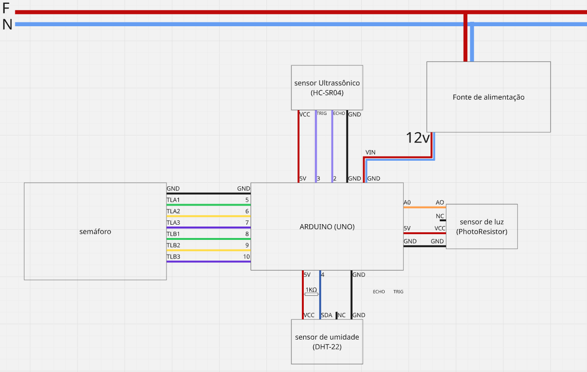
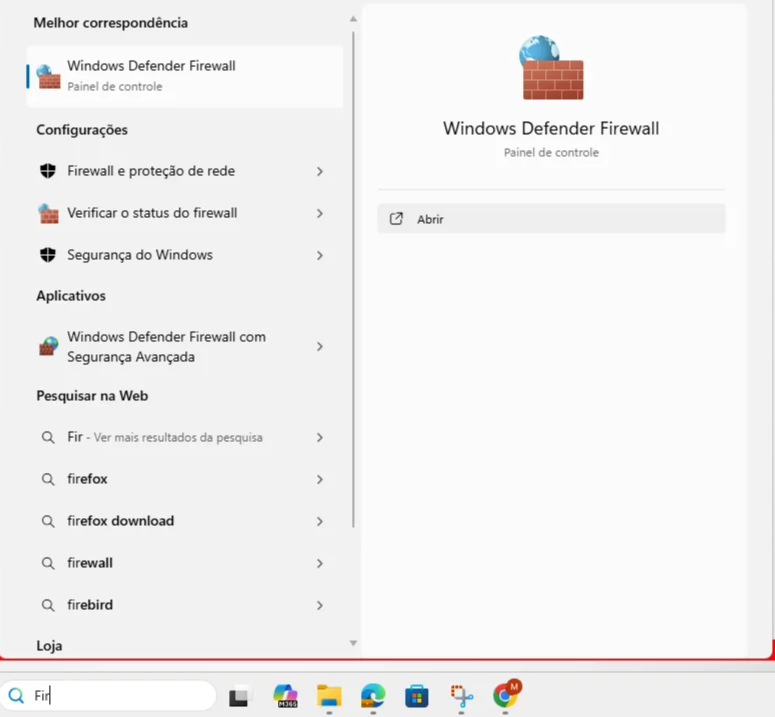
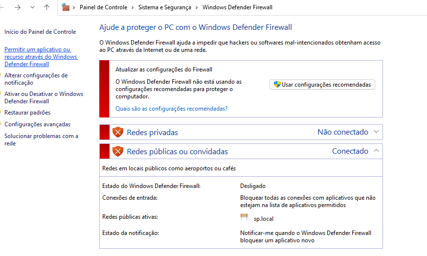
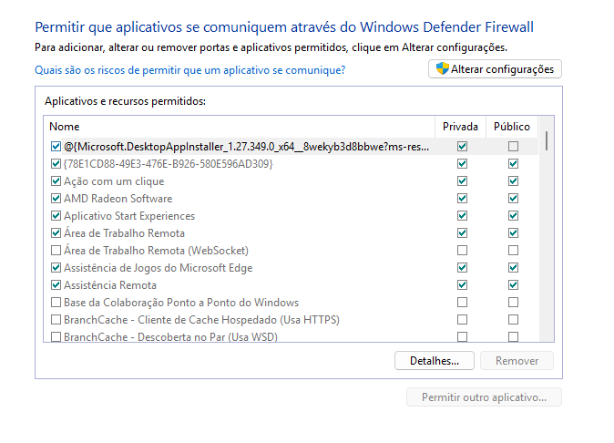
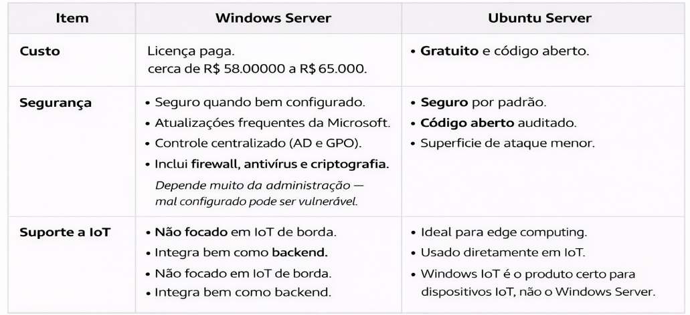
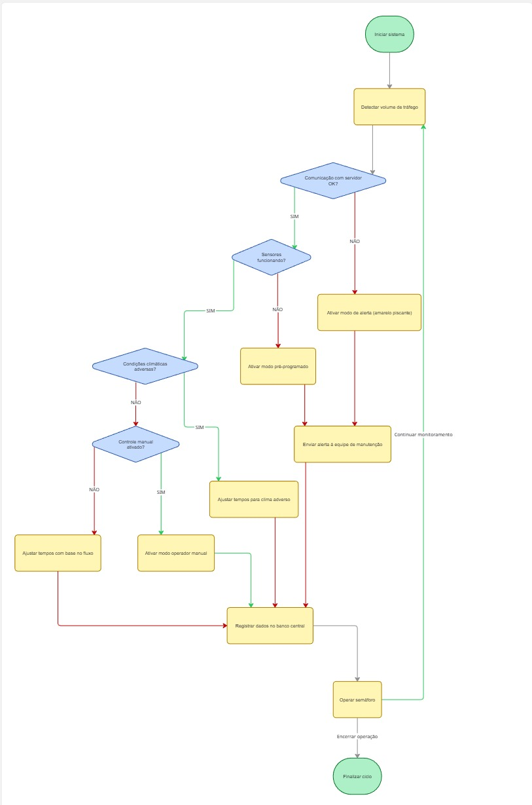

# 🚦Sistema de Semáforo Inteligente 🚦


##  Requisitos Funcionais ✔︎


* **RF1:** Deve detectar o volume de tráfego em cada via do cruzamento utilizando sensores.
* **RF2:** Ajusta a duração dos sinais verde e amarelo com base no fluxo de tráfego em tempo real.
* **RF3:** Permite o controle manual remoto dos sinais de tráfego por um operador.
* **RF4:** Registra e armazena dados de tráfego, falhas de sensores e alarmes em um banco de dados central.
* **RF5:** Entra em modo de alerta (amarelo piscante para todas as direções) se a comunicação com o servidor principal for perdida.
*  **RF6:** Aciona um modo de operação pré-programado em caso de falha de um ou mais sensores de tráfego.
*  **RF7:** Envia alertas automáticos por e-mail ou SMS para a equipe de manutenção em caso de falha do equipamento.
* **RF8:** Adapta a temporização dos sinais em condições climáticas adversas detectadas via sensor de clima.


##  Requisitos Não Funcionais ✔︎


* **RNF1: (Confiabilidade):** O sistema deve funcionar corretamente principalmente nos horários de pico.
* **RNF2: (Desempenho):** O tempo de resposta para ajustar a temporização do semáforo com base nos dados dos sensores deve ser imediato.
* **RNF3: (Segurança):** A comunicação entre sensores, controlador e servidor deve ser criptografada.
* **RNF4: (Usabilidade):** A interface de gerenciamento deve ser intuitiva e requerer treinamento mínimo.
* **RNF5: (Escalabilidade):** O sistema deve suportar até 50 cruzamentos adicionais sem perda de desempenho.
* **RNF6: (Disponibilidade):** O controlador local deve ter uma fonte de alimentação ininterrupta que garanta pelo menos 2 horas de operação em caso de queda de energia.


## 👤 Histórias de Usuário 👤

| Ator | Desejo | Finalidade |
| :--- | :--- | :--- |
| **Motorista** | Que o tempo do sinal verde seja ajustado automaticamente com base no fluxo | Reduzir o tempo de espera no cruzamento. |
| **Técnico de Manutenção** | Receber alertas imediatos no celular quando um sensor falhar | Consertá-lo rapidamente e evitar problemas de tráfego. |
| **Operador de Tráfego** | Acessar remotamente a interface do sistema | Controlar manualmente o semáforo em emergências e gerenciar o fluxo de forma segura. |


## 📊 Priorização (MoSCoW)

| Requisito | Priorização | Explicação |
| :--- | :--- | :--- |
| **RF1, RF2, RNF1, RNF2** |  **MUST HAVE** | Essenciais para a funcionalidade básica e segurança do semáforo inteligente. |
| **RF5, RF6, RNF6** |  **MUST HAVE** | Críticos para a operação em modo de falha e garantia de disponibilidade mínima. |
| **RNF3** |  **MUST HAVE** | Aborda as falhas de segurança identificadas no servidor antigo. |
| **RF4, RF7** |  **SHOULD HAVE** | Importantes para manutenção proativa e análise de dados futuros. |
| **RF3** |  **SHOULD HAVE** | Controle manual é importante, mas não a prioridade do sistema "inteligente". |
| **RF8, RNF4, RNF5** |  **COULD HAVE** | Recursos adicionais que agregam valor. |


Este projeto consiste na modelagem e desenvolvimento de um sistema de trânsito inteligente baseado em **IoT (Internet of Things)**. O sistema controla o fluxo de um semáforo utilizando sensores para detectar a presença de veículos e monitora condições ambientais (luz e umidade) para ajustar o comportamento da sinalização em situações adversas.

---

## 📐 Arquitetura do Sistema

### Topologia de Rede: **Estrela**
Foi selecionada a topologia em estrela, onde o **Arduino (UNO)** atua como o nó central.

* **Controle Centralizado:** O Arduino gerencia todos os sensores e atuadores.
* **Segurança:** Falhas em sensores periféricos não derrubam o sistema principal.
* **Manutenção:** Facilidade para adicionar novos módulos sem interromper o funcionamento da rede.

### 🔌 Diagrama Funcional e Componentes

| Componente | Tipo | Função no Projeto |
| :--- | :--- | :--- |
| **Arduino UNO** | Controlador | "Cérebro" do sistema. Processa dados e controla os semáforos. |
| **Fonte 12V** | Alimentação | Garante energia estável através do pino VIN. |
| **HC-SR04** | Sensor | Ultrassônico. Detecta fluxo de carros para ajustar tempos de espera. |
| **DHT-22** | Sensor | Monitora umidade e temperatura. Aciona modo de alerta em chuvas intensas. |
| **LDR (PhotoResistor)** | Sensor | Mede luminosidade (Dia/Noite) para economia de energia. |
| **LEDs (Semáforo)** | Atuador | Sinalização visual para duas vias (A e B). |

---

## ⚙️ Funcionalidades e Lógica

O código implementa uma lógica de decisão baseada em prioridades:

1.  **Modo de Alerta (Segurança):** Se a umidade ultrapassar **90%** (indicando chuva forte) ou se houver erro de leitura no sensor de distância (`0`), o sistema entra em modo de alerta (Luzes Amarelas piscando).
2.  **Fluxo de Trânsito:** O sistema lê a distância dos veículos. Se houver pouco fluxo (`distance >= 200`), o tempo de sinal verde é reduzido.
3.  **Ciclo Padrão:** Alternância entre Via A e Via B com tempos de segurança (amarelo).

---
## Diagrama Funcional


---

## 💻 Código Fonte

```cpp
#include <DHT.h>
#define PIN_TRIG 3
#define PIN_ECHO 2
#define LDR A0
#define PIN_DHT 4

int tLightsA[3] = {5,6,7};
int tLightsB[3] = {8,9,10};

DHT dht(PIN_DHT,DHT22);


void setup() {
  Serial.begin(9600);
  pinMode(PIN_TRIG, OUTPUT);
  pinMode(PIN_ECHO, INPUT);
  dht.begin();
  for(int i = 0; i<=2;i++) {
    pinMode(tLightsA[i], OUTPUT);
    pinMode(tLightsB[i], OUTPUT);
  }
}


void loop() {
  float valueHumidity;
  int valueLight;
  while (true) {
    int distance = checkFlow();
    valueHumidity = dht.readHumidity();
    valueLight = analogRead(LDR);
    // Serial.print("Distance in CM: ");
    // Serial.println(distance);
    if(valueHumidity >= 90) {
      TurnOffAllLights();
      digitalWrite(tLightsA[1], HIGH);
      digitalWrite(tLightsB[1], HIGH);
      delay(1000);
      digitalWrite(tLightsA[1], LOW);
      digitalWrite(tLightsB[1], LOW);
      delay(1000);
      break;
    }
    if(distance == 0) {
      TurnOffAllLights();
      digitalWrite(tLightsA[1], HIGH);
      digitalWrite(tLightsB[1], HIGH);
      delay(1000);
      digitalWrite(tLightsA[1], LOW);
      digitalWrite(tLightsB[1], LOW);
      delay(1000);
      break;
    }
    digitalWrite(tLightsB[1], LOW);
    digitalWrite(tLightsB[0], HIGH);
    digitalWrite(tLightsA[0], LOW);
    digitalWrite(tLightsA[2], HIGH);
    if(distance >= 200) {
      delay(4000);
    }
    delay(5000);
    digitalWrite(tLightsA[2], LOW);
    digitalWrite(tLightsA[1], HIGH);
    delay(2000);
    digitalWrite(tLightsA[1], LOW);
    digitalWrite(tLightsA[0], HIGH);
    digitalWrite(tLightsB[0], LOW);
    digitalWrite(tLightsB[2], HIGH);
    delay(5000);
    digitalWrite(tLightsB[2], LOW);
    digitalWrite(tLightsB[1], HIGH);
    delay(2000);
  }
  // Serial.print("Analog value in LDR:");
  // Serial.println(valueLight);
  // Serial.print("Humidity value in DHT:");
  // Serial.println(valueHumidity);
}

int checkFlow() {
  digitalWrite(PIN_TRIG, HIGH);
  delayMicroseconds(10);
  digitalWrite(PIN_TRIG, LOW);
  int duration = pulseIn(PIN_ECHO, HIGH);
  if(duration == 0) {
    return 0;
  }
  int distance = duration / 58;
  return distance;
}

void TurnOffAllLights() {
  for(int i = 0; i<=2;i++) {
    digitalWrite(tLightsA[i], LOW);
    digitalWrite(tLightsB[i], LOW);
  }
}

void TurnOnLightsAlert(bool active) {
  TurnOffAllLights();
  while (active) {
    digitalWrite(tLightsA[1], HIGH);
    digitalWrite(tLightsB[1], HIGH);
    delay(1000);
    digitalWrite(tLightsA[1], LOW);
    digitalWrite(tLightsB[1], LOW);
    delay(1000);
  }
  
}

void TurnOnGreenLightA() {
  TurnOffAllLights();
  digitalWrite(tLightsA[0], HIGH);
  digitalWrite(tLightsB[2], HIGH);
}

void TurnOnGreenLightB() {
  TurnOffAllLights();
  digitalWrite(tLightsA[2], HIGH);
  digitalWrite(tLightsB[0], HIGH);
}
```
---

## 🔐 Configuração do Firewall

O firewall foi configurado com o objetivo de aumentar a segurança do servidor, permitindo apenas as portas necessárias para a comunicação do sistema.

### 📷 Verificação do status do firewall



Nesta etapa foi verificado se o firewall estava ativo e funcionando corretamente no sistema.

--

### 📷 Liberação da porta do protocolo MQTT




Foi liberada a porta **1883**, utilizada pelo protocolo MQTT, permitindo a comunicação entre os dispositivos IoT e o servidor.

--

### 📷 Bloqueio de acessos não autorizados



Após a liberação das portas necessárias, o firewall foi configurado para bloquear acessos externos não autorizados, garantindo maior segurança ao sistema.
--
### 📲 Suporte a IoT



---

## 👩‍💻 Fluxograma do Sistema

O fluxograma apresenta o funcionamento de um sistema inteligente de controle de semáforo, que monitora o volume de tráfego por meio de sensores. O sistema verifica a comunicação com o servidor e o funcionamento dos sensores, ativando modos de segurança em caso de falhas. Também considera condições climáticas e a possibilidade de controle manual. Com base nessas análises, os tempos do semáforo são ajustados automaticamente, os dados são registrados em um banco central e o semáforo opera de forma segura e eficiente.


